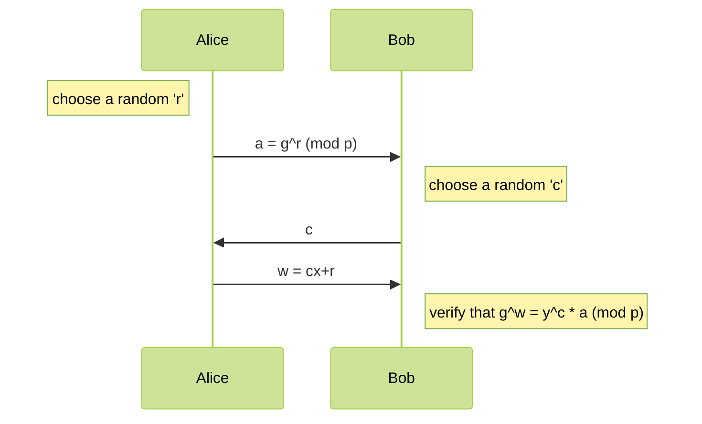

<span style="font-family: Georgia;">
<center>

# CNS HW2

b11902008 笪瑜庭

</center>

---

## Handwriting
### 1. BGP
- **a)** $\text{AS }999$ announced an IP address with a longer prefix, e.g. $10.10.220.0/23$, steering all traffic from $\text{AS }1000$ to itself. 
- **b)** If a DDoS attack occurs, BGP Blackholing would redirect all traffic towards the victim server to a blackhole. Although legitimate traffic would also be dropped, the DDoS attack is successfully mitigated.
- **c)** $\{10.10.220.0/23, [\text{AS } 999, \text{AS } 2, \text{AS } 1, \text{AS } 1000]\}$. This update hijacks AS-paths from $\text{AS }3, 4, 5$ to $\text{AS }1000$, but because of Loop Prevention, $\text{AS }1, 2$ are not affected.
- **d)** **AS Path Prepending**: by prepending AS paths of legitimate routes with multiple instances of an AS, an attacker can make these routes appear longer and less preferable. 
**Loop Prevention**: by injecting routes with specifically crafted AS_PATH attributes that include the target AS, an attacker can cause BGP routers to reject these routes due to the loop prevention mechanism. 
Both of these could lead to reroute of traffic through paths controlled by the attacker.
- **e)** **AS Path Prepending** is actually a good way to spread traffic across the ASes to avoid congestion and prevent some paying end hosts from becoming the intermediate stop of unwanted traffic. **Loop Prevention** can avoid AS paths that contain a loop. 
- **f)** *Advantage*: if an adversary tries to perform prefix hijacking, there is a chance that the announcement will get ignored and the attack fails. 
*Disadvantage*: if a genuine AS announces a prefix longer than the limit, it will get ignored and a possibly better path will not be considered by other ASes.

### 2. Internet Insecurity
- **a)** The server does not allocate resources (i.e. add an entry to the connection table) for half-open connections. Instead, a special kind of ISN, SYN cookie, is crafted and sent in the SYN+ACK packet. A SYN cookie is generated from some information from the SYN packet and some from the server side, including a timestamp and the client's IP address and port number. The timestamp ensures the SYN cookie is only valid for a certain period and cannot be reused. The client's IP address ensures the final ACK message is coming from the same client that initiates the connection, preventing IP spoofing.

- **b)** Theoretically, yes. If an ACK flood attack happens, the targeted server would have to spend a little time processing these ACK messages, which are likely not linked to any half-opened connections and simply get discarded. However, since there are no resources allocated for these ACK packets, this attack is less effective than the SYN flood attack. Hence the influence of an ACK flood attack is more likely to be consuming enough network bandwidth to impact service instead of a successful DoS.
ref: https://security.stackexchange.com/questions/248561/why-ack-flood-is-effective; https://ddos-guard.net/en/terms/ddos-attack-types/fragmented-ack-flood

- **c)** Yes, it is possible to spoof a sender. SPF assumes that if the sender's IP is the same as the IP resolved from the domain name by the DNS server, the sender's identity is verified; however, if the adversary spoofs its IP when sending the email or the DNS server is under attack and giving out false IPs for a domain name, then the adversary can spoof a sender even with SPF working correctly.

### 3. Perfect Zero Knowledge
#### 3.1. Graph Isomorphism
##### a)
First, the bijection $π$ is represented as a permutation matrix $A$ of size $|V_0| \times |V_1|$ as a proof. The matrix is defined such that:
$$
a_{ij} = 
\begin{cases}
1 &\text{if }\pi(u) = v\\
0 &\text{otherwise, }
\end{cases}
$$
where $i$ is the index of $u \in V_0$ and $j$ is the index of $u' \in V_1$. Let's consider the example in **Problem 2**; its isomorphism $\pi$ can be represented as:

$$
A = 
\begin{bmatrix}
1 & 0 & 0 & 0 & 0\\
0 & 0 & 1 & 0 & 0\\
0 & 0 & 0 & 0 & 1\\
0 & 1 & 0 & 0 & 0\\
0 & 0 & 0 & 1 & 0
\end{bmatrix}
$$

Then, the following is the design of the verifier $V$:

1. **Input**: The verifier $V$ takes as input two graphs $G_0 = (V_0, E_0)$ and $G_1 = (V_1, E_1)$, and a proof $A$, which is a permutation matrix representing the bijection $π$.
2. **Verification Steps**:
   - Check if $|E_0| = |E_1|$ and $|V_0| = |V_1|$.
   - Check if $A$ is a valid permutation matrix. This means verifying that each row and each column has exactly one entry of 1 and the rest are 0s. This can be done in $O(|V_0| \times |V_1|)$ time.
   - For each edge $\{u, v\}$ in $E_0$, check if there is a corresponding edge $\{π(u), π(v)\}$ in $E1$ by verifying that if $A[i][j] = 1$ and $A[k][w] = 1$, where $i, j, k, w$ are index of the vertices $u,v \in V_0$ and $u',v' \in V_1$, then $\{u', v'\}$ must be an edge in $E_1$. This step can be done in $O(|E_0|)$ time.
   - If all checks pass, then $V$ outputs $1$, indicating that $G_0 \equiv G_1$ under the bijection $π$. Otherwise, $V$ outputs $0$.

- Completeness: If $G_0 \equiv G_1$, then there exists a permutation matrix $A$ that correctly maps the vertices of $G_0$ to the vertices of $G_1$ and preserves the edge structure. The verifier $V$ will output $1$ after performing the necessary checks in polynomial time.

- Soundness: If $G_0$ is not isomorphic to $G_1$, then for any permutation matrix $A$, the verifier $V$ will not find a complete correspondence of edges under $A$. The verifier $V$ will output $0$, indicating non-isomorphism.

By using a permutation matrix $A \in \{0,1\}^{|V_0| \times |V_1|} \subseteq \{0,1\}^{p(|G_0| + |G_1|)}$ to represent the bijection $π$, we have a proof of size $|V_0| \times |V_1|$, which is polynomial in the size of the graphs $|G_0| + |G_1|$. The verifier $V$ can operate in polynomial time to verify the isomorphism between the two graphs, thus confirming that $\text{GI} \in \mathsf{NP}$.

#### 3.2. Zero-Knowledge Interactive Proof Systems
##### b)
**Completeness**: 
For any two graphs $G_0 \equiv G_1$, 
1. If $b = 0$: $\pi_b = \text{id}_n$ and $\pi_b(G) = \text{id}_n(G_0) = G_0$. Therefore $V$ outputs $[[\pi_b(G) = G_0]] = 1$
2. If $b = 1$: $\pi_b = \pi$ and $\pi_b(G) = \pi(G_0) = G_1$. Therefore $V$ outputs $[[\pi_b(G) = G_1]] = 1$

Hence $\Pr[⟨P, V⟩(G_0, G_1) = 1] = 1$, and $\Pr[⟨P', V'⟩(G_0, G_1) = 1] = 1 > 2/3$. Protocol $\text{A}$ is complete. 


**Soundness**
For any two graphs $G_0 \not\equiv G_1$, 
1. If $b = 0$: $\pi_b = \text{id}_n$ and $\pi_b(G) = \text{id}_n(G_0) = G_0$. Therefore $V$ outputs $[[\pi_b(G) = G_0]] = 1$
2. If $b = 1$: $\pi_b = \pi$ and $\pi_b(G) = \pi(G_0) \neq G_1$. Therefore $V$ outputs $[[\pi_b(G) = G_1]] = 0$

Hence $\Pr[⟨P, V⟩(G_0, G_1) = 1] = 1/2$, and $\Pr[⟨P', V'⟩(G_0, G_1) = 1] = (1/2)^2  = 1/4 < 1/3$. Protocol $\text{A}$ is sound. 

**Perfect Zero-knowledge**
There is a polynomial time cheating verifier $V^∗$ that can find out the isomorphism $\pi$. What $V^*$ does is simply sending $b = 1$ and the honest prover would send $\pi_b = \pi$ to it. Protocol $\text{A}$ is not perfect zero-knowledge.


##### c)
Assume $V^∗$ outputs its view (its inputs, randomness, and messages received from the prover). $S^∗$ does the following:
- $S^∗$ chooses $b' \in _R\{0, 1\}$ and $\tau \in S_n$.
- $S^∗$ sends $G \coloneqq \tau(G_{b'})  $ to $V^∗$ and get a challenge bit $b \in \{0,1\}$.
- If $b = b'$, $S^∗$ sends $\tau^{-1}$ to $V^∗$ and outputs whatever $V^∗$ does.
- If $b\neq b'$, $S^∗$ goes back to step one and use new independent $b'$ and $\tau$.

The $G$ sent by $S^∗$ is distributed identically as $G$ sent by $P$. $S^∗$ sends $G = \tau(G_{b'})$. In the case $b'= 0$, this is exactly the distribution of $G$ sent by $P$. In the case $b'= 1$, since $G_0 \equiv G_1$ and $\tau$ is uniformly distributed in $S_n$,
\[
 \Pr[ G = \tau(G_0) ] = \Pr [G = \tau(G_1)],
\]
Conditioned on the event $b = b'$, since $G$ have the correct distribution, the output of $S^∗$ and $V^∗$ are identically distributed. $S^∗$ retries independently when $b \neq b'$, until $b = b'$, but this makes sure for every graph $g$

\[
Pr[G = g] = Pr[G = g | b = b']
= Pr[G = g \text{ when }V^∗ \text{ is interacting with }P].
\]

That is, the distribution of the view of $V^∗$ when interacting with $S^∗$ is identical the distribution of the view of $V^∗$ when interacting with $S^∗$ and $b = b'$, and is in turn identical to the output of $V^∗$ interacting with $P$. Hence, the output of the simulator $S^∗$ is identically distributed as the view of $V^∗$.

The probability that $b = b'$ is $1/2$, and the expected
number of tries of $S^∗$ is
\[
\sum^\infty_{i = 1} \frac{i}{2^i}
= \sum^\infty_{i = 1} \sum^\infty_{j = i} 2^{-j}
= \sum^\infty_{i = 1} 2^{-i+1} = 2.
\]
Hence $S^*$ runs in expected polynomial time.


#### 3.3. Non-interactive Zero-Knowledge in the plain model
##### d)
Since the interactive proof system is perfect zero-knowledge, there exists a simulator $S$ that can simulate the interaction between $P$ and $V$ such that no efficient algorithm can distinguish between the simulation and the real interaction.
However, the simulator may run for a very long time for some internal randomness. To address this, we can use Markov's Inequality, which states that for a non-negative random variable $X$ and any $a > 0$, the probability that $X$ is at least $a$ times its expected value is at most $1/a$. 
\[\Pr[X \geq a \cdot E(X)] \leq \frac1a\]
In other words, the probability that the simulator runs for an exceptionally long time is low.

The algorithm $A$ runs as follows:
1. Run the simulator $S$. To ensure that $A$ runs in randomized polynomial time, we can modify the simulator $S$ to run for at most $1/\epsilon \cdot t = t/\epsilon$ rounds, where $t$ is the expected number of rounds of $S$ and $\epsilon$ is the error parameter given in the problem. If $S$ does not finish within this time, we abort and output $0$. By Markov's Inequality, the probability that $S$ needs more than $t/\epsilon$ rounds is at most $\epsilon$.
2. If the simulator sucessfully finishes, use $V$'s decision to decide $A$'s output:
   1. If $V$ outputs $1$, output $1$
   2. otherwise, output $0$.

Now, let's analyze the probabilities:
- If $x \in L$, 
\[\Pr[A(x) = 1] \geq 1 - c - \epsilon , \]
because $V$ outputs $1$ with probability at least $1 - c$, and the additional error $\epsilon$ accounts for the probability that $S$ is aborted and outputs $0$ due to the time limit.
- If $x \notin L$,
\[\Pr[A(x) = 1] \leq s,\]
because $V$ would not output $1$ with a probability higher than $s$, given that $x \notin L$.

<div style="page-break-after: always;"></div>

## Capture the Flag

### 4. TLS
Flag: `CNS{TLS_4nD_w1re5h4rK_@rE_FuNNNNN!}`
Ref.: https://mariadb.com/docs/server/security/data-in-transit-encryption/create-self-signed-certificates-keys-openssl/; https://security.stackexchange.com/questions/123851/how-can-i-extract-the-certificate-from-this-pcap-file

Open the pcap file in wireshark, find the packet with the info: `Server Hello, Certificate, Server Hello Done`, and export the raw data with `Export Packet Bytes`. As the certificates are scattered across two segments in the packet, they must be merged into one file `cert.der` after exporting. 

Then by the following commands, we extract the public key from the certificate. With the hint "$p$ and $q$ ... are too close", perform a fermat attack would get us the private key.
```bash
$ openssl x509 -inform der -in cert.der -outform pem -out cert.pem
$ openssl x509 -pubkey -noout -in cert.pem > pubkey.pem
$ ./~/RsaCtfTool/RsaCtfTool.py --publickey pubkey.pem --private --attack fermat
```
Copy the private key to `privkey.pem`. Then in Wireshark, add the private key to `Edit > Preference > RSA keys`, and every `Application Data` packets are now decrypted! After looking through the packets, we can find a username, a password, a command and the root CA key. Save the key to a file `ca-key.pem`.

We can now start to sign a new certificate, as connecting to the service with the certificate and private key above would get the message of us not being the "VIP".  

```bash
# View the content in the server certificate
openssl x509 -inform der -in cert.der -text

# Generate the CA certificate with the root CA key we obtain
openssl req -new -x509 -nodes -days 365000 \
   -key ca-key.pem \
   -out ca-cert.pem
### The information must be the same as the server certificate
Country Name (2 letter code) [AU]:TW
State or Province Name (full name) [Some-State]:Taiwan
Locality Name (eg, city) []:Taipei
Organization Name (eg, company) [Internet Widgits Pty Ltd]:NTU CNS
Organizational Unit Name (eg, section) []:ROOT
Common Name (e.g. server FQDN or YOUR name) []:ROOT
Email Address []:cns@csie.ntu.edu.tw
### Except that the "Name"s should be "ROOT"

# Generate the client's private key and certificate request
openssl req -newkey rsa:2048 -nodes -days 365000 \
   -keyout client-key.pem \
   -out client-req.pem
### The information must be the same as the server certificate
Country Name (2 letter code) [AU]:TW
State or Province Name (full name) [Some-State]:Taiwan
Locality Name (eg, city) []:Taipei
Organization Name (eg, company) [Internet Widgits Pty Ltd]:NTU CNS
Organizational Unit Name (eg, section) []:VIP
Common Name (e.g. server FQDN or YOUR name) []:VIP
Email Address []:cns@csie.ntu.edu.tw
### Except that the "Name"s should be "VIP"

# Generate the client certificate
openssl x509 -req -days 365000 -set_serial 01 \
   -in client-req.pem \
   -out client-cert.pem \
   -CA ca-cert.pem \
   -CAkey ca-key.pem

# Verify the client certificate
openssl verify -CAfile ca-cert.pem \
   ca-cert.pem \
   client-cert.pem

# Connect to the server
openssl s_client -connect cns.csie.org:4000 \
   -cert client-cert.pem -key client-key.pem
```
After finally connecting to the server, enter the username, password and command: 
```
login as: just_a_user
password: IL0VEw1Re5hark
Enter your command:
giveMeTheFl4g
```


### 5. Ditto Knowledge Proof
#### a)
Flag: `CNS{Y0U_1N_7H3_M1DDL3_4774CK_10c9d390f57b6b6f690519206ff3579b}`
The sequence graph:


#### b)
Flag: `CNS{P53UD0_R4ND0M_4R3_N07_R4ND0M_6ee07d69ce5587b46f638c90b341f43f}`
Since the random generator `my_super_secure_random_number_generator` is a Linear Congruential Generator, if we obtain a $c_0$ first, we can predict the value of the next $c$ sent by Bob. Then with this $c$, we sent $a$, where $y^ca \equiv 1 \pmod p$, and $w = 0$. Therefore Bob would verify that $g^0 = y^ca = 1 \pmod p$. 

#### c)
Flag: `CNS{R3PL4Y_4774CK_15_50000_51MPL3_a80e34ed1a90b3ae51755fc290dc81a8}`
Admin saved a pair of $a,w$ in the file `public.py`. Simply send them to Bob will make him believe we are Admin.

#### d) 
Flag: `CNS{CDH_15_1N53CUR3_WH3N_50M37H1N6_F41L3D_f680114b0db7bd36f17b4c129c78f2de}`
Ref.: https://en.wikipedia.org/wiki/Pohlig%E2%80%93Hellman_algorithm; https://medium.com/@mghanbari.maxa/the-elgamal-encryption-algorithm-d59a1d9616f

Weakness: The order is a smooth integer, which is easy to factor. We can implement a Pohlig-Hellman Algorithm to calculate for the private key, and then decrypt the ciphertext encrypted by ElGamal.


### 6. So Anonymous, So Hidden
#### a)
Flag: `CNS{Y0u_Ar3_A_g00D_m1x3R}`
In order to prevent timing analysis, the sequence of outgoing packets cannot be the same as the sequence of incoming ones. Therefore I use `random.shuffle()` to randomize the sequence of every 10 outgoing packets.

#### b)
Flag: `CNS{b0X_1n_B0x_=_b0xC3pTi0n}`
After finishing the functions `create()` and `add_next_hop()`, which respectively correspond to `decrypt_client()` and `decrypt_server()`, we can create a packet whose content is "Give me flag, now!" and add the hops along the designated path.

#### c)
Flag: `CNS{https://youtu.be/jGqpz3stgzY}`
Since the $n$'s in the public keys are small (and even in a fixed range, as $p$ and $q$ are generated with `getPrime(64)`, meaning they are both 64-bit primes), we can factor these $n$'s and then get the private keys. Then by mimicing what servers would do, we can decrypt the packet with `decrypt_server()` until the receiver of the packet is Bob, where we decrypt with `decrypt_client()`.

#### d)
Flag: `CNS{y0u_kN0w_hW1_3_1_d}`
Ref.: https://github.com/torproject/torspec/blob/main/rend-spec-v3.txt; https://gist.github.com/DusanMadar/8d11026b7ce0bce6a67f7dd87b999f6b; https://crypto.stackexchange.com/questions/61302/how-to-solve-this-ecdlp
First of all, extract the domain name from the public key `tor.pub`, which is a v3 domain and is encoded as following:
```typescript
onion_address = base32(PUBKEY | CHECKSUM | VERSION) + ".onion"
CHECKSUM = H(".onion checksum" | PUBKEY | VERSION)[:2]
VERSION = '\x03'
```
The domain is:
`cns24otgzs5zmn2oztxnmiff7bscpg7kp7p6wnkayjnvr5fzxbqzeuqd.onion`
Now we have to start the tor service on our own device, and use the SOCKS5 proxy on the specific port (defaultly `9050`) on our localhost with `socks.set_default_proxy()`. Then by port scanning, we find the service is running on port `11729`.

The last step is solving the ECDLP. Since the elliptic curves are singular, we can use the method from HW1 to map the ECDLP to a DLP on a multiplicative group. (I am too lazy to handle the case where the curve has a cusp instead of a node, so I simply skip those curves.) Finally with the Chinese Remainder Theorem, we can decrypt for the flag! Yay!


---

Here is a list of all the classmates with whom I have discussed this homework: 王褕立、陳愷欣、官毓韋、黃睿家