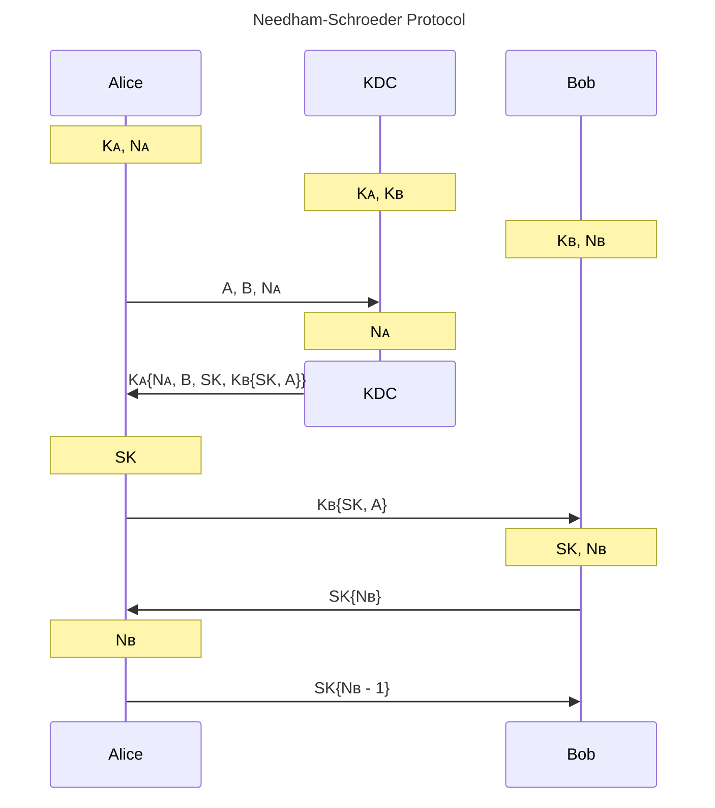

<center>

# CNS HW3

b11902008 笪瑜庭

</center>

---
## 1. Welcome To Fuzzing!
### (a)
Ref.: https://www.fuzzingbook.org/html/GreyboxFuzzer.html; https://en.wikipedia.org/wiki/Fuzzing

AFL is a mutation-based fuzzer, generating new inputs by slightly modifying a seed input (i.e., mutation). Grey-Box Fuzzing combines aspects of both black- and white-box testing, leveraging knowledge such as coverage-feedback to guide the fuzzing without full visibility into the program's internals. If a generated input increases coverage, it is added to the seed corpus. The workflow is as follows: 
1. Instrument the target program to gather coverage information. For AFL, this typically happens at compile-time.
2. Select an initial set of input seeds, which AFL mutates to create new test cases.
3. Execute the instrumented target program with the mutated inputs.
4. Collect coverage information to determine which parts of the code were executed by the test cases.
5. Select inputs that cover new execution paths or trigger potential bugs for further mutation.
6. Analyze crashes or anomalies to identify vulnerabilities.

As for the difference between mutation- and generation-based fuzzers: 
- Mutation-Based Fuzzers: Leverage a set of valid seed inputs and generate new inputs by modifying/mutating these seeds.
- Generation-Based Fuzzers: Create inputs from scratch based on a predefined set of the input format. Not dependent on the quality of seed inputs.

## 2. Needham-Schroeder Protocol
### (a)
Flag: `CNS{N33DH4M_5CHR03D3R_PR070C0L_15_4W350M3_8e7c1985126d2142b87cdbc8ccca86aa}`
Ref.: https://en.wikipedia.org/wiki/Needham%E2%80%93Schroeder_protocol#/media/File:Symetric_Needham-Schroeder-Protocol_%E2%80%93_linear.svg

The sequence diagram (`K{x}` means value `x` is encrypted with key `K`): 

Write-up: Register an account, and then simply act as Alice in the above graph.
### (b)
Flag: `CNS{D0N_7RY_7H15_47_H0M3_e340c50d4e72213257bab1a0deb4a2bd}`
Ref.: https://github.com/kkrypt0nn/wordlists/blob/main/wordlists/passwords/common_roots.txt
- Offline password cracking involves recovering the passwords in case the attacker has access to the password hash file, whereas online password cracking requires interaction between the attacker and the target. In offline password cracking, the attacker can try possible keys (in a "dictionary") without detection or intervention, and goes online only after finding the password.
- Write-up: After performing a dictionary attack with the file `common_roots.txt`, we can login as admin (the password is `m45t3rm1nd`).


### (c)
Flag: `CNS{R3PL4Y_4774CK_15_3V3RYWH3R3?!_d469fa0bd241f15122bc3aa38e8ed7ee}`
Ref.: https://en.wikipedia.org/wiki/Needham%E2%80%93Schroeder_protocol#Fixing_the_attack
- Write-up: In the log on the KDC server, there is an entry containing the `forward_message` and the base64 encoded symmetric key (`SK` in the graph) between Alice and Bob. Then after sending the `forward_message` to Bob, decrypt `SK{Nʙ}` and send `SK{Nʙ - 1}` to Bob.
- The flaw of the KDC server is that it stores past sessions in a insecure way (plaintext) and the Needham-Schroeder Protocol is inherently vulnerable to a replay attack. To fix this problem, the KDC should manage the log in a more secure way, for example encrypt it or delete the entries after a certain time. Another solution is make the KDC to add a timestamp/nonce in the `forward_message` encrypted by `Kʙ`, so this message `Kʙ{SK, A, N}` would only be valid for a short period and would not be exploited by adversaries.

## 3. Accumulator
### (a)
If an attacker knows $p$ and $q$, they can exploit the Euler's theorem, which states that if $a$ and $n$ are coprime positive integers, then $a^{\varphi(n)} \equiv 1 \bmod n$, where $\varphi$ is Euler's totient function. For $n = pq$, $\varphi(n) = (p-1)(q-1)$.

An attacker can create a fake proof for a non-member $u \notin S$ as follows:

1. Since $p$ and $q$ are known, compute $\varphi(n) = (p-1)(q-1)$ and then find $u^{-1}$, the modular multiplicative inverse of $u$ modulo $\varphi(n)$, using the Extended Euclidean Algorithm.

2. Computes the fake proof $\pi' = d(S)^{u^{-1}} \bmod n$. 

3. When verifying, $\pi'^{u} \bmod n$ should equal $d(S)$, because by Euler's theorem: 
\[\pi'^{u} = (d(S)^{u^{-1}})^u = d(S)^{u^{-1} \cdot u} \equiv d(S)^1 = d(S) \pmod n\]

### (b)
For some $s \in S$, we can generate fake non-membership proof as follows. Since $p$ and $q$ are known, compute $\varphi(n) = (p-1)(q-1)$. Then, let $a = s^{-1} \bmod \varphi(n)$, the multiplicative inverse of $s$ modulo $\varphi(n)$. Set $b = 0$, and let the proof be $\pi' = (g^a, b) = (g^{s^{-1}}, 0)$. Therefore, this proof passes the verification because of the Euler's theorem:
\[ (g^a)^s \cdot d^b = g^{s^{-1} \cdot s} \cdot d^0 \equiv g^1 = g \pmod n\]

### (c)
We leverage the property of bilinear maps: $f(a^x, b^y) = f(a, b)^{xy}$ for all $x, y$. One can verify the proof $\pi = g_1^{\prod_{t \in S\setminus\{s\}}(c-t)}$ for $s \in S$ by checking whether $f(\pi, {g_2^c}/{g_2^s}) = f(d(S), g_2)$. For that if $s \in S$, 
\[\begin{align*}
f(\pi, \frac{g_2^c}{g_2^s}) &= f(\pi, g_2^{c-s})\\
&= f\left(g_1^{\prod_{t \in S\setminus\{s\}}(c-t)}, g_2\right)^{c-s} \\
&= f(g_1, g_2)^{{c-s}\prod_{t \in S\setminus\{s\}}(c-t)}\\
&= f(g_1, g_2)^{\prod_{s \in S}(c-s)}\\
&= f(g_1^{\prod_{s \in S}(c-s)}, g_2) = f(d(S), g_2)
\end{align*}\]

### (d)
For some $u \notin S$, we can generate fake membership proof by letting $\pi = d(S)^{\frac{1}{c-u}}$:
\[\begin{align*}
f(\pi, \frac{g_2^c}{g_2^u}) &= f(d(S)^{\frac{1}{c-u}}, g_2^{c-u})\\
&= f(d(S), g_2)^{\frac{1}{c-u}(c-u)} = f(d(S), g_2)
\end{align*}\]

### (e)
One can verify the proof $\pi = \left(g_1^{q(c)}, b\right)$ for $u \notin S$ by checking whether $f(g_1^{q(c)}, {g_2^c}/{g_2^u}) \cdot f(g_1^b, g_2)= f(d(S), g_2)$. For that if $u \notin S$, $q(c)(c-u) + b = p(c) = \prod_{s \in S}(c-s)$, and therefore:
\[\begin{align*}
f(g_1^{q(c)}, \frac{g_2^c}{g_2^u}) \cdot f(g_1^b, g_2) &= f(g_1, g_2^{c-u})^{q(c)} \cdot f(g_1, g_2)^b\\
&= f(g_1, g_2)^{q(c)(c-u)} \cdot f(g_1, g_2)^b\\
&= f(g_1, g_2)^{q(c)(c-u) + b} \\
&= f(g_1, g_2)^{p(c)} \\
&= f(g_1, g_2)^{\prod_{s \in S}(c-s)} \\
&= f\left(g_1^{\prod_{s \in S}(c-s)}, g_2\right) = f(d(S), g_2)
\end{align*}\]

### (f)
For some $s \in S$, we can generate fake non-membership proof by letting $q(c) = p(c)\frac{1}{c - s}$ and $b = order(g_1)$ s.t. $g_1^b \equiv g_1^0$:
\[\begin{align*}
f(g_1^{q(c)}, \frac{g_2^c}{g_2^s}) \cdot f(g_1^b, g_2) &= f(g_1, g_2^{c-s})^{q(c)} \cdot f(g_1^0, g_2)\\
&= f(g_1, g_2)^{q(c)(c-s)} \cdot f(g_1, g_2)^0 \\
&= f(g_1, g_2)^{(p(c)\frac{1}{c - s})(c-s)} \cdot 1\\
&= f(g_1, g_2)^{p(c)} \\
&= f(g_1, g_2)^{\prod_{s \in S}(c-s)} \\
&= f\left(g_1^{\prod_{s \in S}(c-s)}, g_2\right) = f(d(S), g_2)
\end{align*}\]

## 4. DDoS
Ref.: https://techhub.hpe.com/eginfolib/networking/docs/switches/7500/5200-1952a_security_cg/content/495505992.htm
1. (1) 24.945277
    (2) `192.168.232.95`
2. NTP. 482 bytes.
3. A client, since prior to the attack, it has started several TCP connections to different hosts. This is a NTP Amplification DDOS Attack, in which the attacker spoofs several machines' IPs as the victim's and attempts to saturate the victim's bandwidth by sending request to amplifiers, whose responses are all sent to the victim. 
4. 
| (1) IP of the victim | (2) # of packets sent to it | (3) 3 major amplifiers |
| --- | --- | ---|
| `192.168.232.80` | 28320 | `128.111.19.188`, `124.120.108.157`, `129.236.255.89`|
| `192.168.232.10` | 26870 | `34.93.220.190`, `5.104.141.250`, `124.120.108.157` |
| `192.168.232.95` | 23327 | `34.93.220.190`, `128.111.19.188`, `212.27.110.13` |

5. First, send a monlist query by the following command:
```bash
ntpdc -n -c monlist 142.44.162.188
``` 
and then capture traffic with Wireshark. After analyzing the pcapng file, we can calculate the amplification factor. My device sent 1 packet of 234 bytes, and got 100 packets of 482 bytes. $\frac{482 \cdot 100}{234} \approx 205.983$. 

6. Ref.: https://purplesec.us/prevent-dns-amplification-attack/
**As an operator of the amplifier (server)**: To prevent a server from being used as an amplifier in a UDP attack, we can implement response rate limiting to control the amount of traffic sent. Another approach is to configure the server to validate the source IP of incoming requests, ensuring responses are only sent to legitimate clients.
**As the network administrator of the victim’s network**: We can deploy a robust firewall to identify and mitigate abnormal patterns or high-volume traffic, blocking them outside our local network.

## 5. Private Information Retrieval
### (a)
`CNS{1nf0rmat10n_th30r3t1cally_s3cur3}`
Implement according to the problem description. Generate a random $\mu_0$ and calculate $\mu_1$, then from $r_0 + r_1 = X_j$ we can get $X_{ij}$. 

### (b)
`CNS{c011u5i0n_a44ack_unav0idabl3}`
Only the column of the query can be obtained. $\mu_1 - \mu_0 = \hat j$. 


## 6. Randomness Casino
### (a)
`CNS{f1N@L_con7RIbU7iON_47T@cK}`
Since I am the last player choosing a number, I can manipulate the number so that the sum modulo 800 equals my ID.

### (b)
`CNS{MT19937PredictorAlsoKnowsThePast!?}`
The tool I used: https://github.com/NonupleBroken/ExtendMT19937Predictor
Since I am **not** the last player choosing a number, I can feed $32 \times 624$ bits numbers to the predictor, which determines the internal state and predicts the missing numbers, and eventually choose a number such that the sum modulo 800 equals my ID. In the rounds where I know less than 624 numbers, simply guess anything and skip to the next round.
